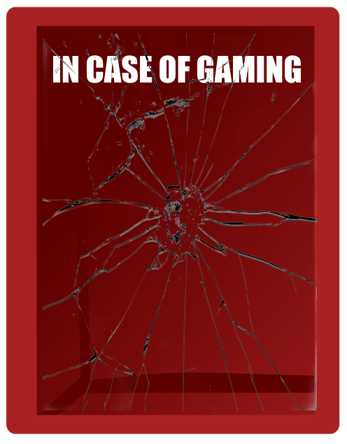

# InCaseOfGaming

  ## Description

Every gamer collects games, wants games, or is interested in games. ICOG is a place for them to create their own customized wishlist and favorites all in one place! 

**Technical stuff:** This is a full stack application using Google Books API. This was built using a MERN stack with a React front end, MongoDB Atlas database, Node.js/Epress.js server and incorporates GraphQL API build with an Apollo Server.
  
  ## Table of Contents
  
  - [Live Site](#live-site)
  - [License](#license)
  - [Credits](#credits)
  - [Thanks!](#thanks)
  
  ## Live Site

  Create your own wishlists here: https://incaseofgaming.onrender.com

  

  ## Credits

* General Reference: https://www.w3schools.com/
* react hooks: https://legacy.reactjs.org/docs/hooks-effect.html#effects-with-cleanup
* google book API docs: https://developers.google.com/books
* MongoDB & Atlas docs: https://www.mongodb.com/docs/
* ApolloServer docs: https://www.apollographql.com/docs/apollo-server/api/apollo-server/
* Render docs: https://docs.render.com/node-version
* GraphQL & Apollo interactions with Render: https://dev.to/emunhoz/create-and-deploy-your-first-graphql-api-with-apollo-server-4-and-railway-2c3b
* Render not finding Vite error: 
  * https://stackoverflow.com/questions/78421809/react-does-not-render-the-default-files-that-are-installed-with-vite
  * https://community.render.com/t/vite-not-found-render-error/16412/4
* Vite docs: https://vitejs.dev/guide/
* GraphQL Introspection error: https://graphql.org/learn/introspection/

## License
This project is covered under the [MIT](https://opensource.org/licenses/MIT) license.

## Thanks!

This project was lovingly developed by the Nervous Duck Pro'duck'tions Team: 
 * <a href="https://github.com/Katherine-Be" class="button big">Katherine-Be</a>
 * <a href="https://github.com/LaneNathan" class="button big">Nathan Lane</a>
 * <a href="https://github.com/ChrisVulpine" class="button big">Chris Leach</a> 

 Thank you all for your support! You are all wonderful and majestic. 🐤 If you have any questions or issues to report, please reach out!

